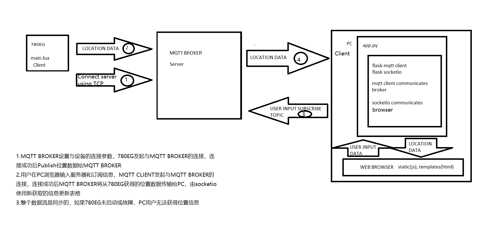

# IoT Location Tracking

An end-to-end GNSS location tracking demo built with an Air780EG device, MQTT, Flask, and Socket.IO. The device reads GNSS data, publishes it through an MQTT broker, and the PC client displays live location and cellular signal data in a web browser.

## Architecture



The data flow is:

1. The Air780EG connects to an MQTT broker over TCP.
2. The device publishes GNSS NMEA data and cellular signal quality (`CSQ`).
3. The Flask client connects to the same broker and subscribes to the device topic.
4. Flask-SocketIO sends each update to the browser, where it is displayed in a table.

The flow is synchronous: if the device is offline or cannot obtain a GNSS fix, the browser will not receive new location data.

## Features

- Collects GNSS data from an Air780EG running LuatOS
- Uses assisted GNSS data to improve acquisition
- Publishes location data over MQTT
- Reports cellular signal strength alongside location data
- Displays live updates in a browser with Flask-SocketIO
- Exports the displayed data as a CSV file
- Provides GNSS-fix and low-battery LED indicators on the device

## Repository Structure

```text
.
├── demo-client/
│   ├── app.py                 # Flask, MQTT, and Socket.IO application
│   ├── static/                # Browser-side JavaScript
│   └── templates/             # HTML pages
├── docs/
│   └── architecture.png       # System architecture diagram
└── lua_files/
    ├── main.lua               # Air780EG GNSS and MQTT application
    ├── libnet.lua
    ├── sysplus.lua
    └── luatide_project.json
```

## Requirements

### Device

- Air780EG or a compatible EC618-based LuatOS device
- GNSS antenna and cellular connectivity
- [LuatOS](https://github.com/openLuat/LuatOS) development tools

### PC

- Python 3.8 or newer
- An MQTT broker reachable by both the device and PC
- A modern web browser

Python packages used by the demo client:

```text
Flask
Flask-MQTT
Flask-SocketIO
pandas
```

## Getting Started

### 1. Configure and flash the device

Open `lua_files/main.lua` in your LuatOS development environment. The example currently connects to the public EMQX broker:

```lua
mqttc = mqtt.create(nil, "broker.emqx.io", 1883)
```

Change the broker address, port, and authentication settings if you use another broker. Flash the files in `lua_files/` to the device, then place the device outdoors with a clear view of the sky so it can obtain a GNSS fix.

The device publishes to a topic based on its IMEI:

```text
/gnss/<device-imei>/up/nmea
```

### 2. Install the PC client dependencies

From the repository root:

```bash
cd demo-client
python -m venv .venv
```

Activate the virtual environment:

```bash
# Windows PowerShell
.venv\Scripts\Activate.ps1

# macOS or Linux
source .venv/bin/activate
```

Install the required packages:

```bash
python -m pip install Flask Flask-MQTT Flask-SocketIO pandas
```

### 3. Run the web client

```bash
python app.py
```

Open [http://127.0.0.1:5000/subscribe](http://127.0.0.1:5000/subscribe) and enter:

- **MQTT Broker Address:** the broker hostname, such as `broker.emqx.io`
- **MQTT Broker Port:** the broker port, such as `1883`
- **Topic:** the device IMEI only; the application constructs `/gnss/<device-imei>/up/nmea`

After the first message arrives, the browser displays timestamp, latitude, longitude, and signal-quality data. Use **Save Table** to download the readings as `sensor_data.csv`.

## MQTT Payload

The device publishes raw NMEA sentences and appends the cellular signal quality in this form:

```text
$csq<value>
```

The PC client extracts latitude and longitude from `$GNRMC` sentences and classifies the CSQ value as weak, medium, or strong.

## Configuration Notes

- The device and PC client must use the same broker and topic.
- If the broker requires authentication, configure `MQTT_USERNAME` and `MQTT_PASSWORD` in `demo-client/app.py` and update the Lua MQTT authentication settings.
- Set `MQTT_TLS_ENABLED` in `demo-client/app.py` to match the broker configuration.
- The included device code uses GPIO 24 for the GNSS-fix LED and GPIO 26 for the low-battery warning LED.
- Public MQTT brokers are useful for testing but should not be used for sensitive or production location data.

## Troubleshooting

- **No location data:** move the GNSS antenna outdoors and wait for a fix.
- **The browser remains on the loading page:** confirm that both clients use the same broker and device IMEI.
- **MQTT connection fails:** verify the broker hostname, port, TLS setting, and credentials.
- **Latitude or longitude is empty:** check that the payload contains a valid `$GNRMC` sentence.

## Acknowledgements

- [LuatOS](https://github.com/openLuat/LuatOS)
- [Flask](https://flask.palletsprojects.com/)
- [Flask-MQTT](https://flask-mqtt.readthedocs.io/)
- [Flask-SocketIO](https://flask-socketio.readthedocs.io/)
